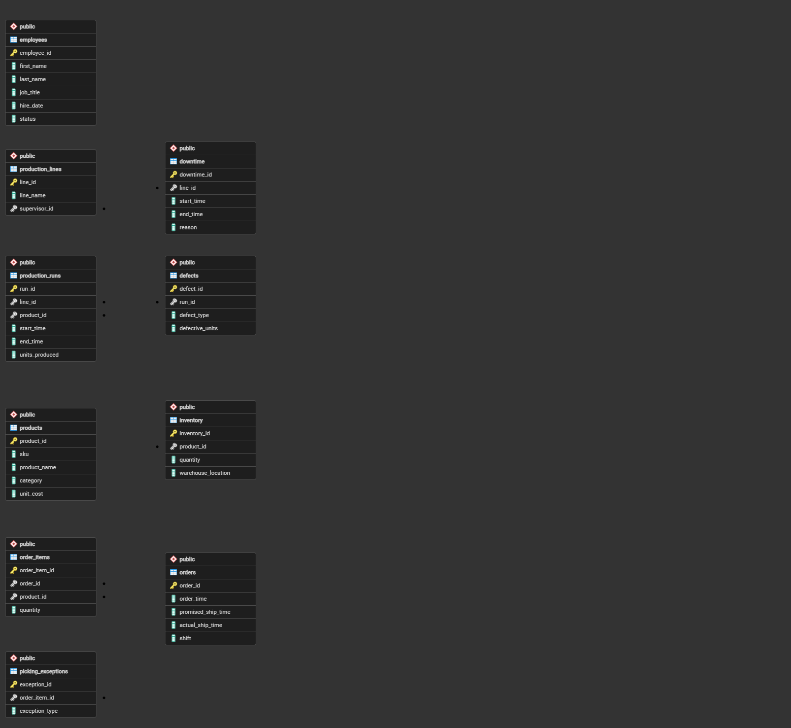

# Factory Operations Analytics Database

## Overview

This project is a PostgreSQL database designed to model and analyze operations in a manufacturing and warehouse environment.

The database tracks production runs, downtime, defects, inventory, customer orders, employees, production lines, and warehouse picking exceptions.

The goal of the project is to use SQL to answer operational questions related to production efficiency, quality control, warehouse performance, and order fulfillment.

## Database ERD

## Database Structure

The project contains 10 related tables:

- `employees` — employee and job information
- `products` — product and SKU information
- `production_lines` — manufacturing lines and supervisors
- `production_runs` — production activity and units produced
- `downtime` — production-line downtime events
- `defects` — defects recorded during production runs
- `inventory` — inventory levels and warehouse locations
- `orders` — customer orders and shipping deadlines
- `order_items` — products and quantities within each order
- `picking_exceptions` — warehouse picking issues

Primary and foreign keys are used to maintain relationships between tables, while CHECK constraints enforce business rules such as non-negative inventory quantities and valid production time ranges.

## Business Questions

The analysis answers six operational questions:

1. Which production lines have the worst downtime-adjusted throughput?
2. Which products have the highest defect rates?
3. Which SKUs generate the most warehouse picking exceptions?
4. What percentage of completed orders miss SLA by shift?
5. What percentage of scheduled production time is lost to downtime by production line?
6. How does each production run rank in output compared with other runs on the same line?

## Key Findings

Using the sample dataset:

- Line C had the lowest downtime-adjusted throughput at approximately 74.04 units per operating hour.
- DOR-200 had the highest product defect rate at 7.50%.
- WIN-100 generated the most picking exceptions, with 5 exceptions.
- Day and Evening shifts each had a 50.00% SLA miss rate among completed orders.
- Line C lost approximately 24.19% of scheduled production time to downtime.

## SQL Skills Demonstrated

This project demonstrates:

- Relational database design
- Primary and foreign keys
- Data integrity constraints
- Multi-table JOINs
- LEFT JOINs and NULL handling
- Aggregate functions
- GROUP BY and conditional aggregation
- CASE expressions
- Common Table Expressions (CTEs)
- Window functions
- Timestamp and interval calculations
- Time-range overlap logic
- Business KPI calculations
- Grain management and prevention of duplicate aggregation

## Project Files

- `schema.sql` — creates the database tables and relationships
- `seed_data.sql` — inserts the sample factory and warehouse data
- `analysis.sql` — contains the operational analysis queries

## Tools

- PostgreSQL
- pgAdmin 4

## How to Run

1. Create an empty PostgreSQL database.
2. Run `schema.sql`.
3. Run `seed_data.sql`.
4. Run the queries in `analysis.sql`.

## Notes

The dataset used in this project is fictional and was created for demonstration and portfolio purposes.